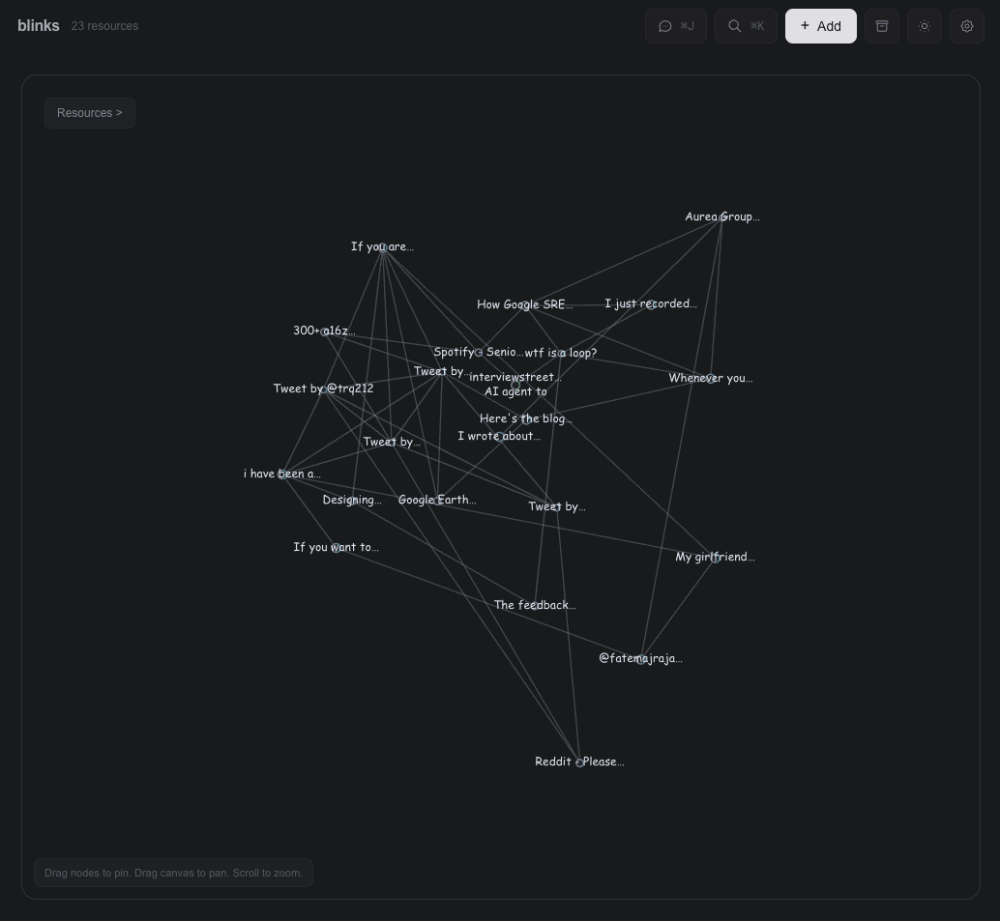
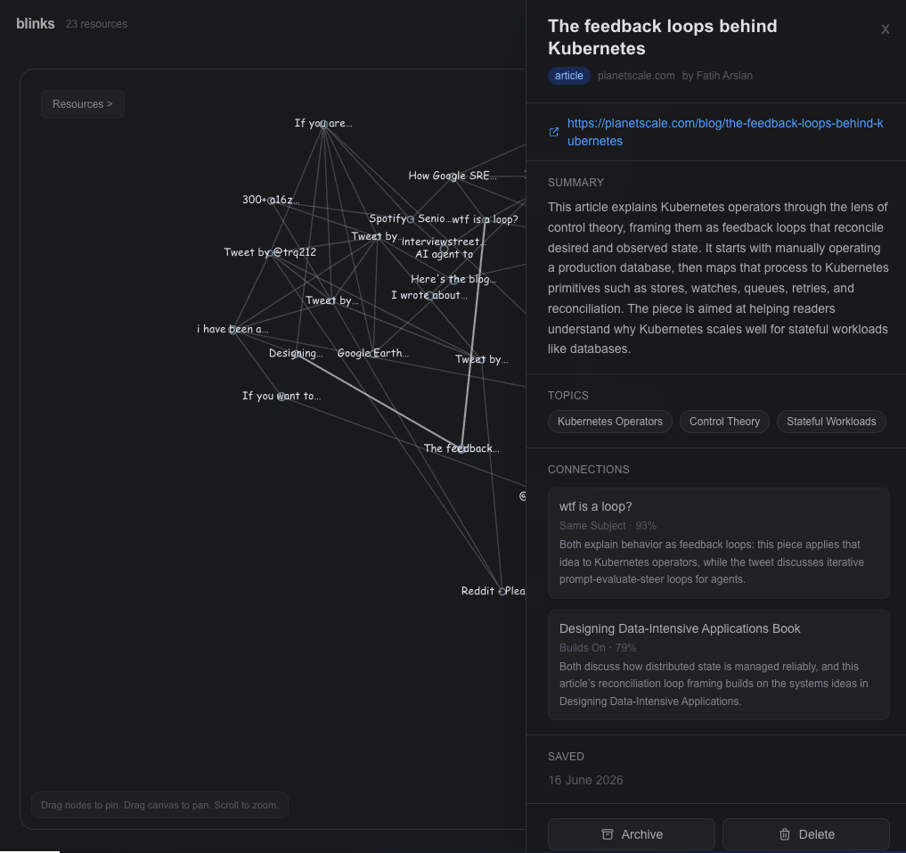

# blinks

A local-first, AI-powered knowledge graph for your saved web resources. Paste a URL, and blinks fetches the content, classifies it with an LLM, discovers connections between your resources, and renders everything as an interactive graph you can explore and chat with.

<p align="center">
  
  
</p>

> **Bring Your Own Key** -- blinks does not ship any API keys. You supply your
> own OpenAI, Anthropic, or Ollama setup. All LLM calls run against your
> credentials, on your account. Nothing is proxied through a third party.

---

## Features

- **Save and classify** -- paste a URL and blinks fetches the page content, generates a title, summary, key concepts, and topic tags via LLM
- **Knowledge graph** -- resources and topics render as an interactive force-directed graph with drag, zoom, and click-to-inspect
- **Semantic connections** -- a second LLM pass finds typed relationships between resources (same subject, builds on, contrasts, applies, source reference, duplicate)
- **Chat** -- ask questions about your saved resources; the LLM answers grounded in your knowledge base, with the option to file answers back as notes
- **Search** -- full-text search across all topics, resources, titles, summaries, and authors
- **Dark and light mode** -- toggle between themes; preference is saved in your browser
- **PWA** -- installable on mobile and desktop with share-target support (share URLs directly from other apps into blinks)
- **Authentication** -- optional login wall via environment variables to protect access on shared networks
- **Three LLM providers** -- OpenAI (cloud), Anthropic/Claude (cloud), or Ollama (local, fully offline)
- **Supported sources** -- auto-detects Twitter/X, YouTube, GitHub, ArXiv, Medium, Reddit, Substack, Spotify, Hacker News, Stack Overflow, Wikipedia, and any generic webpage

---

## How to use the app

To add a resource, click **+ Add** (or press `Ctrl+N`), paste the resource's URL, and submit it. Blinks will fetch and process the resource, then add it to your knowledge graph.

---

## Stack

| Layer | Technology |
|-------|------------|
| Framework | Next.js 16 (App Router) |
| UI | React 19, TypeScript, Tailwind CSS 4 |
| Database | Cloudflare D1 (SQLite) via Drizzle ORM |
| Graph | react-force-graph-2d + dagre layout |
| LLM | OpenAI, Anthropic, or Ollama (raw fetch, no SDK) |
| Content extraction | defuddle (reader mode) + open-graph-scraper |
| Deployment | OpenNext on Cloudflare Workers (optional) |

---

## Quickstart

### 1. Prerequisites

- **Node.js 22+** and **npm 10+**
- One of:
  - An [OpenAI API key](https://platform.openai.com/api-keys) (default provider)
  - An [Anthropic API key](https://console.anthropic.com/settings/keys)
  - [Ollama](https://ollama.com) installed locally (no API key needed)

### 2. Clone and install

```bash
git clone https://github.com/RishabhKodes/blinks.git
cd blinks
npm install
```

### 3. Configure environment

```bash
cp .env.example .env
```

Open `.env` and set your provider. Pick one of the three options below:

**Option A -- OpenAI (default)**

```bash
LLM_PROVIDER=openai
OPENAI_API_KEY=sk-...
```

**Option B -- Anthropic (Claude)**

```bash
LLM_PROVIDER=claude
ANTHROPIC_API_KEY=sk-ant-...
```

**Option C -- Ollama (local, no key needed)**

```bash
LLM_PROVIDER=ollama
OLLAMA_MODEL=llama3.2
```

Make sure `ollama serve` is running before you start the app. See the [Ollama section](#using-ollama-local-models) below for full setup.

### 4. Initialize the database

```bash
npm run db:migrate:local
```

This applies the SQL migrations from `drizzle/` to your local D1 SQLite database stored under `.wrangler/state/`.

### 5. Start the app

```bash
npm run dev
```

Open [http://localhost:3000](http://localhost:3000).

### 6. Verify everything works

1. Go to [/settings](http://localhost:3000/settings) and confirm your provider and key status show green.
2. Click **+ Add** (or press `Ctrl+N`) and paste any URL.
3. Confirm the resource appears as a node in the graph.
4. Open Chat (`Cmd+J` / `Ctrl+J`) and ask a question to verify LLM streaming works.

---

## LLM Providers

blinks supports three providers. Set `LLM_PROVIDER` in your `.env` to switch between them. You must restart the dev server after changing this value.

### OpenAI

The default provider. Requires `OPENAI_API_KEY`.

```bash
LLM_PROVIDER=openai
OPENAI_API_KEY=sk-...
```

OpenAI uses separate models for different tasks. You can override each one individually or use the defaults:

| Variable | Default | Used for |
|----------|---------|----------|
| `OPENAI_MODEL` | `gpt-5.5` | Chat and general LLM calls |
| `OPENAI_CLASSIFICATION_MODEL` | `gpt-5-mini` | Resource classification (title, summary, topics) |
| `OPENAI_CONNECTION_MODEL` | `gpt-5.4-mini` | Judging connections between resources |
| `OPENAI_JSON_FALLBACK_MODEL` | `gpt-5.4-mini` | Retry model when classification JSON parsing fails |

### Anthropic (Claude)

Requires `ANTHROPIC_API_KEY`.

```bash
LLM_PROVIDER=claude
ANTHROPIC_API_KEY=sk-ant-...
```

Claude also supports per-task model overrides:

| Variable | Default | Used for |
|----------|---------|----------|
| `CLAUDE_MODEL` | `claude-sonnet-4-20250514` | All tasks (chat, classification, connections) |
| `CLAUDE_CLASSIFICATION_MODEL` | Same as `CLAUDE_MODEL` | Resource classification override |
| `CLAUDE_CONNECTION_MODEL` | Same as `CLAUDE_MODEL` | Connection discovery override |
| `CLAUDE_JSON_FALLBACK_MODEL` | `claude-sonnet-4-20250514` | Retry model for classification |

### Ollama (Local Models)

Ollama lets you run LLMs locally with no cloud API key and no data leaving your machine. blinks talks to Ollama via its OpenAI-compatible API.

**Setup:**

1. Install Ollama from [ollama.com](https://ollama.com).

2. Pull a model:
   ```bash
   ollama pull llama3.2
   ```

3. Start the Ollama server (if not already running):
   ```bash
   ollama serve
   ```

4. Set your `.env`:
   ```bash
   LLM_PROVIDER=ollama
   OLLAMA_MODEL=llama3.2
   # OLLAMA_BASE_URL=http://localhost:11434   # default, change only if needed
   ```

5. Start blinks: `npm run dev`

6. Go to `/settings` and confirm the Ollama status badge shows **Connected**.

**Recommended models:**

blinks requires models that follow JSON instructions reliably. Good options:

| Model | Size | Notes |
|-------|------|-------|
| `llama3.2` | 3B | Fast, good JSON output, low RAM usage |
| `mistral` | 7B | Strong instruction following |
| `qwen2.5` | 7B | Good multilingual + JSON support |
| `llama3.3` | 70B | Best quality, needs 48GB+ RAM |

Ollama uses a single model for all tasks (classification, connections, chat). Set it via `OLLAMA_MODEL`.

blinks has built-in JSON repair for malformed LLM output, so even smaller models work reasonably well. If classification consistently fails, try a larger model.

---

## Authentication

blinks includes an optional login wall. When enabled, all pages (except the login page itself) require a username and password.

**To enable:**

Set both variables in your `.env`:

```bash
AUTH_USERNAME=admin
AUTH_PASSWORD=your-password-here
```

**To disable:** remove or leave both variables unset.

**How it works:**
- On login, the credentials are hashed (SHA-256) and stored as a session cookie (`blinks-session`).
- Sessions last 30 days.
- The cookie is HTTP-only and uses the `secure` flag in production.
- If either `AUTH_USERNAME` or `AUTH_PASSWORD` is missing, auth is completely bypassed and the app is open to anyone who can reach it.

This is useful when you access blinks over your local network or expose it via a tunnel.

---

## Keyboard Shortcuts

| Shortcut | Action |
|----------|--------|
| `Ctrl+N` | Open the Add Resource modal |
| `Cmd+K` / `Ctrl+K` | Toggle Search palette |
| `Cmd+J` / `Ctrl+J` | Toggle Chat panel |
| `Escape` | Close any open modal, panel, or palette |
| `Enter` | Send a chat message |
| `Arrow Up` / `Arrow Down` | Navigate search results |

---

## Mobile Access

The blinks UI is fully responsive -- the graph, panels, modals, and chat all adapt to small screens.

### Browser access (works immediately)

Next.js 16 binds to all network interfaces by default, so `npm run dev` is already reachable from any device on the same WiFi.

1. Find your local IP:
   ```bash
   # macOS
   ipconfig getifaddr en0

   # Linux
   hostname -I | awk '{print $1}'

   # Windows
   ipconfig | findstr IPv4
   ```

2. On your phone, open `http://<your-ip>:3000`

The full app works in the mobile browser -- browse the graph, add URLs, chat, search, everything.

**Tip:** If you are on a shared network, enable [authentication](#authentication) to protect access.

### Install as app (requires HTTPS)

For the full PWA experience (standalone app window, "blinks" in the system share sheet), you need HTTPS. Over plain HTTP the app works fine in the browser, but the service worker and install prompt are unavailable.

**Quick HTTPS with Cloudflare Tunnel** (free, no account for quick tunnels):

```bash
# Install: brew install cloudflared (macOS) or see https://developers.cloudflare.com/cloudflare-one/connections/connect-networks/downloads/
cloudflared tunnel --url http://localhost:3000
```

This gives you a temporary `https://....trycloudflare.com` URL.

**Then install on your device:**

- **iOS**: Open the HTTPS URL in Safari, tap Share, then **Add to Home Screen**
- **Android**: Open in Chrome, tap the menu, then **Install App** or **Add to Home Screen**

Once installed, blinks opens as a standalone fullscreen app. The system share sheet includes "blinks" as a target -- share any URL from your browser or other apps and it auto-saves to your knowledge graph.

---

## How It Works

### Ingestion pipeline

When you add a URL:

1. **Content extraction** -- blinks fetches the page, runs it through `defuddle` for reader-mode text extraction, and pulls OpenGraph metadata (title, description, image) via `open-graph-scraper`. Special handling for Twitter/X (via FxTwitter API, no auth needed), YouTube, GitHub, and other platforms.
2. **LLM classification** -- the extracted text (truncated to 4000 characters) is sent to your LLM provider, which returns: a cleaned title, summary, key concepts, "why it matters" analysis, resource type, and topic tags.
3. **Topic creation** -- new topics are created as needed, and the resource is linked to its topics. Related topics are connected via `topicLinks`.
4. **Connection discovery** -- blinks runs a second LLM pass using a TF-IDF pre-filter (ranks all existing resources by text similarity, takes the top 18 candidates) and then asks the LLM to judge which are genuinely related. Connections require a minimum 0.72 confidence score and are typed (same_subject, builds_on, contrasts, applies, source_reference, duplicate). Each resource gets at most 4 connections.

### Graph

The main page renders an interactive force-directed graph using `react-force-graph-2d`. Nodes represent resources, sized and colored by topic. Click a node to open its detail panel. Drag to reposition nodes -- positions are saved server-side.

### Chat

Chat loads your entire knowledge base (all topics, resources, and links) as context, then streams LLM responses. You can file chat answers back into your knowledge base as either:
- **Enhance topic** -- appends the answer to a topic's description under a "Q&A Insights" section
- **New resource** -- creates a new note-type resource linked to a topic

### Search

Press `Cmd+K` to open the search palette. It searches across topic names, topic descriptions, resource titles, resource summaries, authors, and sources using SQL LIKE matching.

### Graph rebuild

If you change your LLM provider or want to re-evaluate all connections with a different model, go to `/settings` and click **Rebuild**. This re-runs the connection discovery pipeline on every resource pair. Existing resource data, topics, and saved node positions are preserved -- only the LLM-generated connections are replaced.

### Wiki compilation (API only)

blinks can synthesize all resources under a topic into a coherent article. This is available via the API only (no UI):

```bash
# Compile a single topic
curl -X POST http://localhost:3000/api/compile \
  -H 'Content-Type: application/json' \
  -d '{"topicId": "<topic-id>"}'

# Compile all topics
curl -X POST http://localhost:3000/api/compile \
  -H 'Content-Type: application/json' \
  -d '{"topicId": "all"}'

# Check compilation status
curl http://localhost:3000/api/compile
```

---

## Environment Variables Reference

All variables are set in `.env` (or `.env.local`). Restart the dev server after any change.

### LLM Provider

| Variable | Required | Default | Description |
|----------|----------|---------|-------------|
| `LLM_PROVIDER` | No | `openai` | Which provider to use: `openai`, `claude`, or `ollama` |

### OpenAI

| Variable | Required | Default | Description |
|----------|----------|---------|-------------|
| `OPENAI_API_KEY` | When provider is `openai` | -- | Your OpenAI API key |
| `OPENAI_MODEL` | No | `gpt-5.5` | Model for chat and general use |
| `OPENAI_CLASSIFICATION_MODEL` | No | `gpt-5-mini` | Model for resource classification |
| `OPENAI_CONNECTION_MODEL` | No | `gpt-5.4-mini` | Model for connection discovery |
| `OPENAI_JSON_FALLBACK_MODEL` | No | `gpt-5.4-mini` | Fallback model when classification JSON parsing fails |

### Anthropic (Claude)

| Variable | Required | Default | Description |
|----------|----------|---------|-------------|
| `ANTHROPIC_API_KEY` | When provider is `claude` | -- | Your Anthropic API key |
| `CLAUDE_MODEL` | No | `claude-sonnet-4-20250514` | Model for all Claude tasks |
| `CLAUDE_CLASSIFICATION_MODEL` | No | Same as `CLAUDE_MODEL` | Override model for classification |
| `CLAUDE_CONNECTION_MODEL` | No | Same as `CLAUDE_MODEL` | Override model for connections |
| `CLAUDE_JSON_FALLBACK_MODEL` | No | `claude-sonnet-4-20250514` | Fallback model for classification retries |

### Ollama

| Variable | Required | Default | Description |
|----------|----------|---------|-------------|
| `OLLAMA_MODEL` | No | `llama3.2` | Ollama model name (used for all tasks) |
| `OLLAMA_BASE_URL` | No | `http://localhost:11434` | Ollama server address |

### Authentication

| Variable | Required | Default | Description |
|----------|----------|---------|-------------|
| `AUTH_USERNAME` | No | -- | Set together with `AUTH_PASSWORD` to enable login wall |
| `AUTH_PASSWORD` | No | -- | Set together with `AUTH_USERNAME` to enable login wall |

---

## Database

blinks uses Cloudflare D1 (SQLite) locally via Wrangler. The database files are stored under `.wrangler/state/` (gitignored).

### Initialize or reset

```bash
# Apply migrations (first run or after pulling new migrations)
npm run db:migrate:local

# Full reset (deletes all data, starts fresh)
rm -rf .wrangler/state/v3/d1
npm run db:migrate:local
```

### Schema

The database has 8 tables:

| Table | Purpose |
|-------|---------|
| `topics` | Topic names and descriptions |
| `resources` | Saved URLs with title, summary, type, author, source, thumbnail |
| `resourceTopics` | Many-to-many link between resources and topics |
| `topicLinks` | Connections between related topics |
| `resourceLinks` | LLM-judged connections between resources (with type, reason, confidence) |
| `graphPositions` | Saved x/y positions for graph nodes |
| `wikiCompilations` | Status tracking for wiki compilation per topic |
| `lintResults` | Knowledge base quality audit findings (internal) |

### Migrations

Migrations live in the `drizzle/` directory and are generated by Drizzle Kit:

```bash
# Generate a new migration after changing src/lib/db/schema.ts
npx drizzle-kit generate

# Apply migrations locally
npm run db:migrate:local
```

---

## Scripts

| Script | Command | Description |
|--------|---------|-------------|
| `npm run dev` | `next dev` | Start development server |
| `npm run build` | `next build --webpack` | Production build |
| `npm start` | `next start` | Start production server |
| `npm run lint` | `eslint` | Run ESLint |
| `npm test` | `node --test ...` | Run unit tests (connection ranking) |
| `npm run db:init:local` | `wrangler d1 execute ...` | Initialize local D1 from raw SQL |
| `npm run db:migrate:local` | `wrangler d1 migrations apply ...` | Apply Drizzle migrations locally |
| `npm run build:worker` | `npx @opennextjs/cloudflare build` | Build for Cloudflare Workers |
| `npm run preview` | build:worker + `wrangler dev` | Local Cloudflare Workers preview |
| `npm run deploy` | build:worker + `wrangler deploy` | Build and deploy to Cloudflare |

---

## Deploy to Cloudflare (Optional)

For a permanent deployment with HTTPS (also enables full PWA on mobile):

1. Create a D1 database on Cloudflare:
   ```bash
   wrangler d1 create blinks-db
   ```

2. Update `wrangler.jsonc` with the `database_id` from the output above.

3. Apply migrations to the remote database:
   ```bash
   wrangler d1 migrations apply blinks-db --remote
   ```

4. Set your secrets:
   ```bash
   # For OpenAI
   wrangler secret put OPENAI_API_KEY

   # For Claude
   wrangler secret put ANTHROPIC_API_KEY

   # For auth (optional)
   wrangler secret put AUTH_USERNAME
   wrangler secret put AUTH_PASSWORD
   ```

5. Deploy:
   ```bash
   npm run deploy
   ```

The deployment uses OpenNext to compile the Next.js app into a Cloudflare Worker. The `wrangler.jsonc` file configures the Worker name, D1 binding, and static assets.

---

## API Reference

All endpoints are under `/api/`. Responses are JSON unless noted.

| Endpoint | Method | Description |
|----------|--------|-------------|
| `/api/ingest` | POST | Ingest a URL: `{url, notes?}`. Returns classified resource with topics. 409 if duplicate. |
| `/api/resources` | GET | List all resources with topic IDs |
| `/api/resources` | POST | Create a resource manually (no LLM classification) |
| `/api/resources/[id]` | PATCH | Archive or unarchive: `{action: "archive" \| "unarchive"}` |
| `/api/resources/[id]` | DELETE | Permanently delete a resource |
| `/api/resources/archived` | GET | List archived resources |
| `/api/topics` | GET | List all topics |
| `/api/topics` | POST | Create a topic |
| `/api/topics/[id]` | GET | Get a topic with its resources |
| `/api/graph` | GET | Get all graph nodes and resource-to-resource links |
| `/api/graph` | POST | Save node positions: `{positions: {id, x, y}[]}` |
| `/api/graph/rebuild` | GET | Get connection stats (resource count, connection count) |
| `/api/graph/rebuild` | POST | Re-run connection discovery on all resources |
| `/api/chat` | POST | Streaming chat: `{messages: ChatMessage[]}` |
| `/api/file` | POST | File chat output: `{content, action, topicId, title?}` |
| `/api/search` | GET | Search: `?q=query` |
| `/api/compile` | POST | Wiki compilation: `{topicId}` or `{topicId: "all"}` |
| `/api/compile` | GET | Compilation status: `?topicId=...` or all |
| `/api/settings` | GET | Current config (no secrets exposed) |
| `/api/auth/login` | POST | Authenticate: `{username, password}` |

---

## Project Structure

```
blinks/
  src/
    app/
      api/            # API routes (ingest, chat, graph, resources, etc.)
      login/          # Login page (shown when auth is enabled)
      settings/       # Settings page
      share/          # PWA share target handler
      page.tsx        # Main graph page
      layout.tsx      # Root layout with PWA meta tags
      manifest.ts     # PWA manifest
      globals.css     # Theme variables (light/dark)
    components/
      Graph.tsx       # Force-directed graph visualization
      SidePanel.tsx   # Resource detail panel
      ChatPanel.tsx   # Chat interface
      SearchPalette.tsx  # Search overlay
      AddResourceModal.tsx  # URL input modal
      ArchivedPanel.tsx    # Archived resources
      AppProvider.tsx      # Theme + global state
    lib/
      db/             # Drizzle schema and database connection
      llm/            # LLM abstraction (OpenAI, Claude, Ollama)
      content/        # URL content fetcher and parser
      graph/          # Connection ranking (TF-IDF)
      vault/          # Markdown vault export (stubs)
    middleware.ts     # Optional auth middleware
  drizzle/            # SQL migration files
  public/             # Static assets (icons, service worker)
  wrangler.jsonc      # Cloudflare Workers config
  .env.example        # Environment variable template
```

---

## Troubleshooting

**"OPENAI_API_KEY is required" or "ANTHROPIC_API_KEY is required"**
Check your `.env` file, make sure the key is set for your chosen `LLM_PROVIDER`, then restart `npm run dev`.

**"no such table ..."**
Run `npm run db:migrate:local` to apply migrations.

**Ollama: classification fails or returns empty results**
- Make sure `ollama serve` is running.
- Verify the model is pulled: `ollama list` should show your model.
- Try a larger model (`mistral` or `qwen2.5`) if JSON output is consistently malformed.
- Check `OLLAMA_BASE_URL` if Ollama runs on a non-default port or host.
- Check `/settings` -- the Ollama status badge should show **Connected**.

**Ollama: "fetch failed" or connection refused**
- Ollama defaults to `http://localhost:11434`. If you changed the port, set `OLLAMA_BASE_URL` in `.env`.
- On Linux, check if Ollama is bound to `127.0.0.1` vs `0.0.0.0`.

**Mobile: can't reach the app from phone**
- Confirm your phone and computer are on the same WiFi network.
- Check your firewall allows incoming connections on port 3000.
- Use `http://<ip>:3000`, not `https`.

**Mobile: "Install App" option not available**
PWA install requires HTTPS. Use `cloudflared tunnel` or deploy to Cloudflare (see sections above).

**Wrangler / D1 commands fail**
Upgrade to Node 22+ (`node --version`).

**Graph looks empty after adding resources**
Check the browser console for errors. The most common cause is an LLM API key issue -- go to `/settings` to verify.

**Chat returns "LLM request failed"**
This is a generic error to avoid leaking API details. Check the server terminal for the actual error. Common causes: expired API key, rate limit, or network issue.

---

## Roadmap

- [ ] Provider selection from the Settings UI (no restart required)
- [ ] Support for more providers (Gemini, Groq, Mistral API)

## Contributing

See [CONTRIBUTING.md](./CONTRIBUTING.md).

## Security

See [SECURITY.md](./SECURITY.md).

## License

MIT -- see [LICENSE](./LICENSE).
